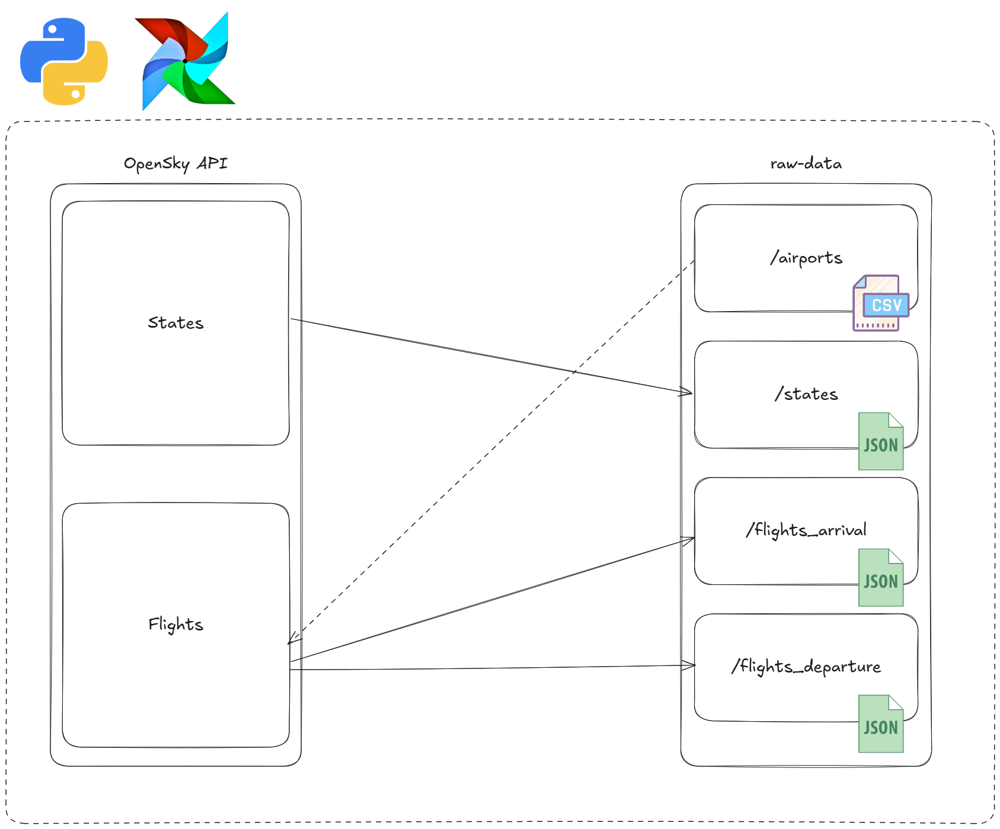

# OpenSky Lambda Pipeline – Fase 1 (Raw Data)

## Explicación lógica de la Fase 1

En esta primera fase no buscamos todavía transformar ni limpiar datos, sino algo más básico pero fundamental: **asegurarnos de no perder información**.  
La API de OpenSky solo expone datos en tiempo real, sin histórico. Eso significa que, si no capturamos los datos en el momento exacto, se pierden para siempre.

Por eso, hemos montado un sistema que hace lo siguiente:

- **Cada 90 segundos** preguntamos a la API por el estado de todos los aviones que sobrevuelan la Península Ibérica (posición, altitud, velocidad…).  
- **Cada 12 horas** consultamos a la API las llegadas y salidas de los aeropuertos peninsulares que tenemos listados en un archivo CSV.  
- Todo lo que recibimos lo guardamos en ficheros crudos (`raw-data`), tal cual nos llega, sin añadir metadatos ni modificar nada. La única organización que imponemos es **guardar por carpetas de fecha**, para poder localizar los datos fácilmente más adelante.

De esta manera conseguimos un **histórico propio y completo**: aunque OpenSky no nos lo dé, nosotros lo reconstruimos.  
Más adelante, en fases Bronze/Silver/Gold, ya limpiaremos, estructuraremos y analizaremos esta información.  

---

## Estructura actual

```
opensky-lambda-pipeline/
│
├── dags/                         # DAGs de Airflow para orquestar ingestas
│   ├── ingest_opensky_states_raw.py
│   └── ingest_opensky_flights_raw.py
│
├── python_jobs/                   # Cliente de OpenSky (lógica de ingesta)
│   └── opensky_client.py
│
├── utils/                         # Utilidades auxiliares
│   ├── token_manager.py
│   └── airports.py
│
├── raw-data/                      # Almacenamiento crudo (snapshots)
│   └── airports/peninsular_airports.csv
│
├── docker-compose.yml             # Orquestación de servicios (Airflow, Postgres…)
├── requirements.txt               # Dependencias Python
└── README.md
```

---

## Componentes principales

- **`raw-data/airports/peninsular_airports.csv`**  
  CSV estático con los aeropuertos de la Península Ibérica (ICAO, IATA, nombre, etc.).  
  Usado por los DAGs para decidir qué aeropuertos consultar cada 12h.
  Descargado de Wikipedia y limpiado a mano.

- **`utils/token_manager.py`**  
  Gestiona el **OAuth2** con OpenSky. Pide tokens, los cachea y renueva cuando expiran.

- **`utils/airports.py`**  
  Función para cargar la lista de ICAOs desde el CSV.

- **`python_jobs/opensky_client.py`**  
  Cliente genérico de la API de OpenSky. Incluye:  
  - Descarga de `/states/all` → guardado como **NDJSON comprimido (gzip)** cada 90 s.  
  - Descarga de `/flights/arrival` y `/flights/departure` por aeropuerto → guardado cada 12 h.  
  - Organización en carpetas particionadas por fecha.  
  - CLI para ejecutar comandos manualmente.

- **`dags/ingest_opensky_states_raw.py`**  
  DAG de Airflow que lanza cada **90 segundos** la ingesta de `states` (bounding box Península).

- **`dags/ingest_opensky_flights_raw.py`**  
  DAG de Airflow que cada **12 horas** recorre los aeropuertos del CSV y descarga arrivals + departures.

---

## Flujo de datos

1. **Airflow DAGs** lanzan la ingesta en intervalos regulares:
   - `opensky_states_raw`: cada 90 segundos.
   - `opensky_flights_raw`: cada 12 horas.

2. **Cliente OpenSky** (`opensky_client.py`) consulta la API con autenticación OAuth2.

3. Las respuestas se guardan en **`raw-data/`**:  
   - `/states/date=YYYY-MM-DD/...json.gz`  
   - `/flights_arrival/tag=ICAO/date=YYYY-MM-DD/...json.gz`  
   - `/flights_departure/tag=ICAO/date=YYYY-MM-DD/...json.gz`

4. **Persistencia garantizada:** aunque la API de OpenSky no ofrece histórico, el pipeline conserva snapshots continuos para poder reconstruir ventanas de tiempo posteriores.

---

## Diagrama de la fase 1



---

## Estado actual

- [x] **Raw ingestion** desde OpenSky API funcionando.  
- [x] **TokenManager** implementado (OAuth2 con cache).  
- [x] **DAGs en Airflow** programados (90s y 12h).  
- [x] **Estructura de almacenamiento raw** lista (sin metadatos, sin limpieza).  
- [ ] Próxima fase: normalización y partición en capa **Bronze (y más adelante Silver/Gold)**.  
