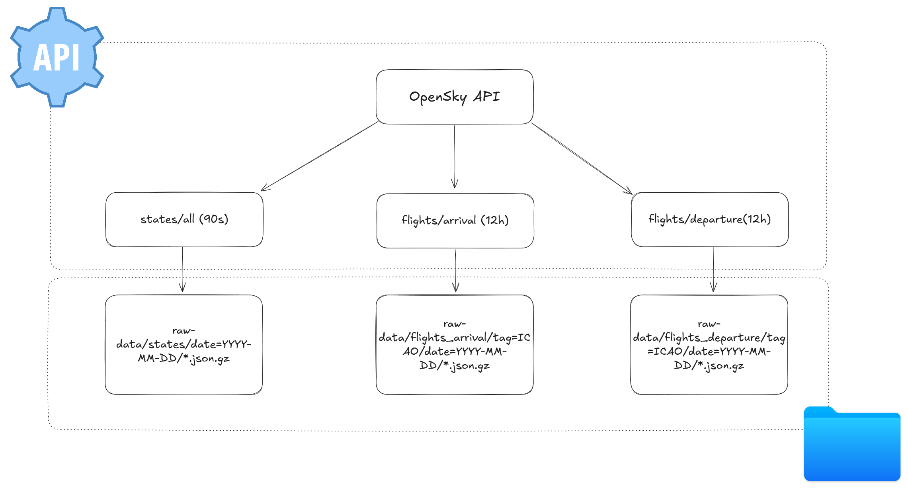

# Data Lineage – OpenSky Lambda Pipeline (Fase 1)

## Origen de datos
- **API de OpenSky**  
  - `/states/all` → posiciones y estado de aeronaves.  
  - `/flights/arrival` → llegadas a aeropuertos.  
  - `/flights/departure` → salidas de aeropuertos.  
- **Archivo estático**: `raw-data/airports/peninsular_airports.csv`

## Procesos de ingesta
- **DAG `opensky_states_raw`**  
  - Frecuencia: cada 90 segundos.  
  - Acción: obtiene datos de `/states/all` para la Península Ibérica.  

- **DAG `opensky_flights_raw`**  
  - Frecuencia: cada 12 horas.  
  - Acción: obtiene arrivals y departures de cada aeropuerto en `peninsular_airports.csv`.

## Destino (Raw Layer)
- `raw-data/states/date=YYYY-MM-DD/...json.gz`  
- `raw-data/flights_arrival/tag=ICAO/date=YYYY-MM-DD/...json.gz`  
- `raw-data/flights_departure/tag=ICAO/date=YYYY-MM-DD/...json.gz`  

## Flujo resumido
1. **Airflow DAGs** disparan las ingestas programadas.  
2. **TokenManager** autentica contra la API de OpenSky.  
3. **OpenSkyClient** consulta la API y guarda respuestas crudas en ficheros `.json.gz`.  
4. Los datos se almacenan en `raw-data/`, organizados por fecha y tipo de consulta.  

## Diagrama de lineage (fase 1)

